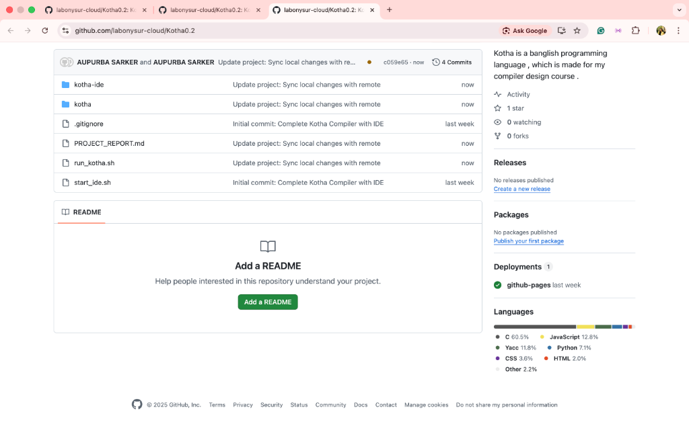

<div align="center">

  
  <br/>
  <br/>

  # 🇧🇩 Kotha (কথা) Programming Language
  
  **A Powerful "Banglish" Programming Language Built for the Future**
  <br/>
  
  [](https://github.com/labonysur-cloud/Kotha0.2)
  [](LICENSE)
  [](https://github.com/labonysur-cloud/Kotha0.2)
  []()
  
  [Features](#-features) • [Installation](#-installation) • [Usage](#-usage) • [Documentation](#-documentation) • [Examples](#-examples)

</div>

---

## 🚀 Introduction

**Kotha** is a unique programming language designed to bridge the gap between Bengali culture and modern computer science. By using "Banglish" (Bengali words written in English script) keywords, it makes coding more accessible and fun for Bengali speakers, while retaining the power of C-style languages.

Whether you are building simple scripts, developing 2D games, or training Machine Learning models, Kotha has the tools you need.

<div align="center">
  <h3>✨ The Kotha IDE ✨</h3>
  
</div>

---

## 🌟 Features

Kotha 0.2 is packed with advanced features:

### 🛠 Core Language
- **Banglish Syntax**: Write code using familiar words like `dhoro` (let), `dekhaw` (print), `jodi` (if).
- **Strongly Typed**: Robust type system with integers, floats, and strings.
- **Virtual Machine**: compiled to bytecode and executed on a high-performance VM.

### 🎮 Game Development
- **Built-in Game Engine**: Create 2D games with ease.
- **Example Games**: Includes implementations of *Pong*, *Snake*, and *Tic-Tac-Toe*.
- **Graphics Support**: Simple graphics primitives for drawing and animation.

### 🤖 Machine Learning & AI
- **ML Bridge**: Integrated support for Machine Learning tasks.
- **Ready-to-Run Examples**:
  - CNN Classifier
  - K-Means Clustering
  - YOLO Object Detection
  - RNN/LSTM networks

### 💻 Developer Experience
- **Kotha IDE**: A web-based IDE with syntax highlighting, file management, and instant execution.
- **REPL**: Interactive shell for quick testing.
- **Standard Library**: Rich set of libraries for String manipulation, Math, and File I/O.

---

## 📦 Installation

To get started with Kotha, clone the repository and build the compiler:

```bash
# Clone the repository
git clone https://github.com/labonysur-cloud/Kotha0.2.git

# Navigate to the project directory
cd Kotha0.2

# Build the compiler and tools
make
```

---

## 🖥 Usage

### Running the IDE
Experience Kotha through our modern web-based IDE:

```bash
# Start the IDE server
./start_ide.sh
```
Then open your browser at `http://localhost:8081`.

### Command Line
You can also compile and run Kotha files directly from the terminal:

```bash
# Run a Kotha program
./run_kotha.sh your_program.kotha
```

---

## 📝 Examples

Here is a glimpse of what Kotha code looks like:

<details open>
<summary><b>Hello World</b></summary>

```c
main function {
    dekhaw("Hello, Kotha World!");
}
```
</details>

<details>
<summary><b>Variables & Loops</b></summary>

```c
main function {
    // Declarations
    dhoro count = 0;
    
    // Loop
    jotokhon (count < 5) {
        dekhaw("Count is: ");
        dekhaw(count);
        count = count + 1;
    }
}
```
</details>

<details>
<summary><b>Machine Learning Demo (Snippet)</b></summary>

```c
// Example of ML configuration in Kotha
dhoro learning_rate = 0.01;
dhoro epochs = 100;

proshikkhon(data) {
    // Training logic...
    dekhaw("Training model...");
}
```
</details>

---

## 📚 Documentation

For more detailed information, check out the following resources included in the repository:

- 📄 **[Project Report](PROJECT_REPORT.md)**: Comprehensive architectural overview.
- 🎮 **Game Dev Guide**: Learn how to build games in Kotha.
- 🧠 **ML Guide**: Deep dive into the Machine Learning capabilities.

---

## 🤝 Contributing

We welcome contributions to Kotha! Please feel free to submit a Pull Request.

1. Fork the Project
2. Create your Feature Branch (`git checkout -b feature/AmazingFeature`)
3. Commit your Changes (`git commit -m 'Add some AmazingFeature'`)
4. Push to the Branch (`git push origin feature/AmazingFeature`)
5. Open a Pull Request

---

<div align="center">
  Developed with ❤️ by <b>Labony Sur</b>
  <br/>
  <i>Empowering coders in their native tongue.</i>
</div>
