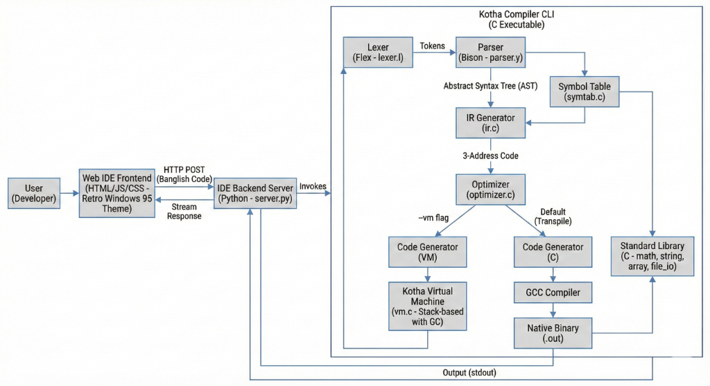

<div align="center">

  
  <br/>
  <br/>

  # 🇧🇩 Kotha (কথা) Programming Language
  
  **A Powerful "Banglish" Programming Language.**
  <br/>
  
  [](https://github.com/labonysur-cloud/Kotha0.2)
  [](LICENSE)
  [](https://github.com/labonysur-cloud/Kotha0.2)
  []()
  
  [Features](#-features) • [Installation](#-installation) • [Usage](#-usage) • [Documentation](#-documentation) • [Examples](#-examples)

</div>

---

## 🚀 Introduction

**Kotha** is a unique programming language designed to bridge the gap between Bengali culture and modern computer science. By using "Banglish" (Bengali words written in English script) keywords, it makes coding more accessible, while retaining the power of C-style languages.

It features a custom compiler, a high-performance register-based Virtual Machine (VM), and a rich set of standard libraries.

<div align="center">
  <h3>✨ The Kotha IDE ✨</h3>
  
</div>

---

## 🌟 Supported Features

Kotha 0.2 currently supports the following fully functional features:

### 🛠 Core Language
- **Banglish Syntax**: Familiar keywords like `purno` (int), `doshomik` (float), `bornona` (string), `dekhaw` (print), `jodi` (if), `noyto` (else), `jotokkhon` (while).
- **Data Types**: Support for Integers (`purno`), Floats (`doshomik`), Strings (`bornona`), and Booleans (`sotyo_mittha`).
- **C-Style Declarations**: Multiple variable declarations in one line: `purno x, y, z = 10;`
- **String Concatenation**: Use `+` operator to concatenate strings with automatic type conversion: `"Age: " + age`
- **Type Casting**: 12 conversion functions for explicit type conversions (e.g., `purno_to_doshomik()`, `bornona_to_purno()`)
- **Type Inspection**: `typeof()` operator for runtime type checking
- **Control Flow**: `if-else` conditionals and `while` loops.
- **Functions**: Define and call functions with arguments and return values.
- **Virtual Machine**: Code is compiled to bytecode and executed on a custom high-performance VM.

### 📚 Standard Library
- **String Library**: String manipulation functions like `length`, `concatenate`, `reverse`, etc.
- **Math Library**: Common mathematical functions including `sin`, `cos`, `power`, `sqrt`.
- **File I/O**: Read from and write to files directly from Kotha.
- **Array Support**: Create and manipulate arrays.

### 💻 Development Tools
- **Kotha IDE**: A web-based Integrated Development Environment with syntax highlighting and file management.
- **REPL**: interactive Read-Eval-Print Loop for quick coding sessions.
- **CLI**: Command-line interface for compiling and running scripts.

---

## 📚 Keyword Reference

Complete list of all Kotha keywords organized by category:

### Data Types
| Keyword | English | Description | Example |
|---------|---------|-------------|---------|
| `purno` | Integer | Whole numbers | `purno age = 25;` |
| `doshomik` | Float | Decimal numbers | `doshomik pi = 3.14;` |
| `bornona` | String | Text/characters | `bornona name = "Kotha";` |
| `sotyo_mittha` | Boolean | True/False values | `sotyo_mittha flag = sotti;` |
| `sthir` | Constant | Immutable value | `sthir purno MAX = 100;` |

### Boolean Literals
| Keyword | English | Description |
|---------|---------|-------------|
| `sotti` | True | Boolean true value |
| `mittha` | False | Boolean false value |

### Control Flow
| Keyword | English | Description | Example |
|---------|---------|-------------|---------|
| `jodi` | If | Conditional statement | `jodi (x > 0) { ... }` |
| `noyto` | Else | Alternative condition | `noyto { ... }` |
| `othoba` | Else If | Chained condition | `othoba (x < 0) { ... }` |
| `jotokkhon` | While | Loop while condition is true | `jotokkhon (i < 10) { ... }` |
| `cholbe` | For | For loop | `cholbe (i theke 0 porjonto 10) { ... }` |
| `theke` | From | Loop start value | Used with `cholbe` |
| `porjonto` | To | Loop end value | Used with `cholbe` |
| `paltaw` | Switch | Switch statement | `paltaw (x) { ... }` |
| `holo` | Case | Switch case | `holo 1: { ... }` |
| `ses` | Break | Exit loop/switch | `ses;` |

### Functions
| Keyword | English | Description | Example |
|---------|---------|-------------|---------|
| `kaj` | Function | Define a function | `add kaj (purno a, purno b) { ... }` |
| `ferot` | Return | Return value from function | `ferot a + b;` |
| `void` | Void | Function with no return value | `print kaj void () { ... }` |
| `main function` | Main | Program entry point | `main function { ... }` |

### Input/Output
| Keyword | English | Description | Example |
|---------|---------|-------------|---------|
| `dekhaw` | Print | Output to console | `dekhaw("Hello");` |
| `nao` | Input | Read user input | `nao(x);` |

### Type Operations
| Keyword | English | Description | Example |
|---------|---------|-------------|---------|
| `typeof` | Type Of | Get variable type | `typeof(x)` returns `"purno"` |

### Type Conversion Functions
| Function | Description | Example |
|----------|-------------|---------|
| `purno_to_doshomik()` | Int → Float | `purno_to_doshomik(42)` → `42.0` |
| `purno_to_bornona()` | Int → String | `purno_to_bornona(42)` → `"42"` |
| `purno_to_sotyo_mittha()` | Int → Boolean | `purno_to_sotyo_mittha(1)` → `sotti` |
| `doshomik_to_purno()` | Float → Int | `doshomik_to_purno(3.14)` → `3` |
| `doshomik_to_bornona()` | Float → String | `doshomik_to_bornona(3.14)` → `"3.14"` |
| `doshomik_to_sotyo_mittha()` | Float → Boolean | `doshomik_to_sotyo_mittha(0.0)` → `mittha` |
| `bornona_to_purno()` | String → Int | `bornona_to_purno("42")` → `42` |
| `bornona_to_doshomik()` | String → Float | `bornona_to_doshomik("3.14")` → `3.14` |
| `bornona_to_sotyo_mittha()` | String → Boolean | `bornona_to_sotyo_mittha("")` → `mittha` |
| `sotyo_mittha_to_purno()` | Boolean → Int | `sotyo_mittha_to_purno(sotti)` → `1` |
| `sotyo_mittha_to_doshomik()` | Boolean → Float | `sotyo_mittha_to_doshomik(sotti)` → `1.0` |
| `sotyo_mittha_to_bornona()` | Boolean → String | `sotyo_mittha_to_bornona(sotti)` → `"sotti"` |

### Data Structures
| Keyword | English | Description | Example |
|---------|---------|-------------|---------|
| `talika` | Array | Array/List | `purno talika arr = new talika[10];` |
| `new` | New | Create new object/array | `new talika[size]` |

### Utility
| Keyword | English | Description | Example |
|---------|---------|-------------|---------|
| `random` | Random | Generate random number | `purno r = random();` |
| `porishkar` | Clear | Clear screen | `porishkar();` |
| `wait` | Wait | Pause execution | `wait(1000);` |
| `songjukto` | Concatenate | String concatenation | `songjukto(str1, str2)` |

### Exception Handling
| Keyword | English | Description | Example |
|---------|---------|-------------|---------|
| `try` | Try | Try block | `try { ... }` |
| `catch` | Catch | Catch exceptions | `catch (error) { ... }` |
| `finally` | Finally | Finally block | `finally { ... }` |
| `throw` | Throw | Throw exception | `throw error;` |

### Operators
| Operator | Description | Example |
|----------|-------------|---------|
| `+` | Addition / String concatenation | `x + y` or `"Hello " + name` |
| `-` | Subtraction | `x - y` |
| `*` | Multiplication | `x * y` |
| `/` | Division | `x / y` |
| `%` | Modulo | `x % y` |
| `==` | Equal to | `x == y` |
| `!=` | Not equal to | `x != y` |
| `>` | Greater than | `x > y` |
| `<` | Less than | `x < y` |
| `>=` | Greater than or equal | `x >= y` |
| `<=` | Less than or equal | `x <= y` |
| `&&` | Logical AND | `x && y` |
| `||` | Logical OR | `x || y` |
| `!` | Logical NOT | `!x` |

---

## 📦 Installation

### Prerequisites

**For macOS/Linux:**
- GCC or Clang compiler
- Make
- Flex (lexer generator)
- Bison (parser generator)
- Python 3.x (for IDE)

**For Windows:**
- **Option 1: WSL (Recommended)**
  - Install [Windows Subsystem for Linux (WSL)](https://docs.microsoft.com/en-us/windows/wsl/install)
  - Follow the macOS/Linux instructions below inside WSL
  
- **Option 2: MinGW/MSYS2**
  - Install [MSYS2](https://www.msys2.org/)
  - Install required packages:
    ```bash
    pacman -S mingw-w64-x86_64-gcc make flex bison python3
    ```

### Building from Source

**macOS/Linux/WSL:**
```bash
# Clone the repository
git clone https://github.com/labonysur-cloud/Kotha0.2.git

# Navigate to the project directory
cd Kotha0.2

# Build the compiler and tools
cd kotha
make
```

**Windows (MinGW/MSYS2):**
```bash
# Clone the repository
git clone https://github.com/labonysur-cloud/Kotha0.2.git

# Navigate to the project directory
cd Kotha0.2/kotha

# Build using MinGW Make
mingw32-make
```

> **Note:** The compiled `kotha` executable will be created in the `kotha/` directory.

---

## 🖥 Usage

### Running the IDE

**macOS/Linux/WSL:**
```bash
# Start the IDE server
cd kotha-ide
python3 server.py

# Or use the helper script
./start_ide.sh
```

**Windows (MinGW/MSYS2):**
```bash
# Navigate to IDE directory
cd kotha-ide

# Start the server
python server.py
```

Then open your browser at `http://localhost:8081`.

### Command Line

**macOS/Linux/WSL:**
```bash
# Run a Kotha program directly
./kotha/kotha your_program.kotha

# Or use the helper script
./run_kotha.sh your_program.kotha
```

**Windows (MinGW/MSYS2):**
```bash
# Run a Kotha program
./kotha/kotha.exe your_program.kotha

# Or if in the kotha directory
./kotha your_program.kotha
```

### Interactive REPL

**macOS/Linux/WSL:**
```bash
# Start the REPL
./kotha/kotha
```

**Windows (MinGW/MSYS2):**
```bash
# Start the REPL
./kotha/kotha.exe
```

> **Tip:** Running without arguments starts the interactive REPL mode.

### Platform-Specific Notes

**Windows Users:**
- If using WSL, you get the full Linux experience with better compatibility
- MinGW/MSYS2 works but may require adjusting file paths in scripts
- The IDE server requires Python 3.x - ensure it's in your PATH
- Use forward slashes (`/`) in file paths, not backslashes (`\`)

**macOS Users:**
- Xcode Command Line Tools include GCC/Clang
- Install Homebrew for easy package management: `brew install flex bison`

**Linux Users:**
- Install build tools: `sudo apt install build-essential flex bison` (Debian/Ubuntu)
- Or: `sudo yum install gcc make flex bison` (RHEL/CentOS)

---

## 🏗 System Architecture

The Kotha compiler follows a robust multi-stage pipeline, transforming Banglish source code into executable actions via a custom Virtual Machine.

<div align="center">
  
</div>

**Pipeline Flow:**
1.  **Lexer/Parser**: Tokenizes Banglish code and builds an AST.
2.  **IR Generator**: Converts the AST into 3-Address Code (Intermediate Representation).
3.  **Optimizer**: Optimizes the IR for better performance.
4.  **Code Generator**: Translates IR into Bytecode for the VM.
5.  **Virtual Machine**: Executes the bytecode, managing stack and memory.

---

## 📂 Project Structure

```bash
Kotha0.2/
├── assets/                 # Images for documentation
├── kotha/                  # Core compiler source code
│   ├── kotha               # Compiled executable
│   ├── parser.y            # Bison parser grammar
│   ├── lexer.l             # Flex lexer definitions
│   ├── vm.c                # Virtual Machine implementation
│   ├── ir.c                # Intermediate Representation generation
│   ├── codegen_vm.c        # Bytecode generation
│   └── *_lib.c             # Standard libraries (math, string, file, array)
├── kotha-ide/              # Web-based IDE
│   ├── examples/           # Sample Kotha programs
│   ├── public/             # Frontend assets (HTML, CSS, JS)
│   └── server.py           # Backend server (Python)
├── PROJECT_REPORT.md       # Detailed technical documentation
├── README.md               # Main documentation
└── run_kotha.sh            # Helper script to execute programs
```

---

## 📝 Examples

Here is a glimpse of working Kotha code:

### ▼ Hello World
```kotha
main function {
    dekhaw("Hello, Kotha World!");
}
```

### ▼ Variables & Type Casting
```kotha
main function {
    // C-style multiple declarations
    purno x = 42, y = 10, z;
    doshomik pi = 3.14;
    
    // Type casting
    bornona num_str = purno_to_bornona(x);
    doshomik float_x = purno_to_doshomik(x);
    
    // String concatenation with automatic type conversion
    dekhaw("Value of x: " + x);
    dekhaw("Type of x: " + typeof(x));
    dekhaw("Pi value: " + pi);
}
```

### ▼ Control Flow
```kotha
main function {
    purno a = 10;
    purno b = 20;
    
    jodi (a < b) {
        dekhaw("B is larger");
    } noyto {
        dekhaw("A is larger");
    }
}
```

### ▼ String Manipulation
```kotha
main function {
    bornona name = "Kotha";
    purno length = kotha_strlen(name);
    
    dekhaw("Language: " + name);
    dekhaw("Length: " + length);
}
```

### ▼ Loops
```kotha
main function {
    purno i = 0;
    
    jotokkhon (i < 5) {
        dekhaw("Count: " + i);
        i = i + 1;
    }
}
```

### ▼ Functions
```kotha
add kaj (purno a, purno b) {
    ferot a + b;
}

main function {
    purno result = add(10, 20);
    dekhaw("Sum: " + result);
}
```

---

## 📚 Documentation

For more detailed information, check out the following resources included in the repository:

- 📄 **[Project Report](PROJECT_REPORT.md)**: Architectural overview.
- 📁 **[Examples](kotha-ide/examples/)**: A collection of working Kotha programs.

---

## 🤝 Contributing

We welcome contributions! Please feel free to submit a Pull Request.

1. Fork the Project
2. Create your Feature Branch
3. Commit your Changes
4. Push to the Branch
5. Open a Pull Request

---

<div align="center">
  Developed by <b>Labony Sur</b>
  <br/>
  <i>Empowering coders in their native tongue.</i>
</div>
